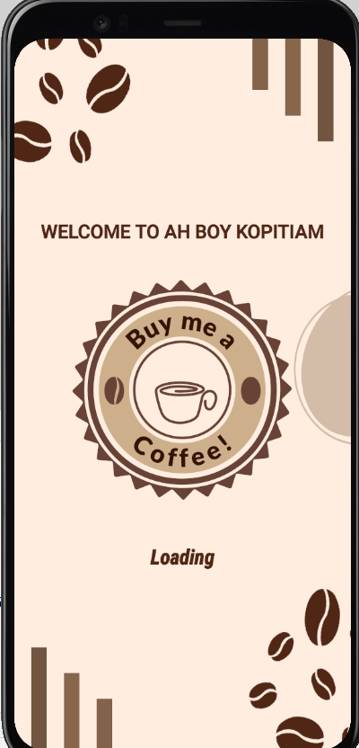
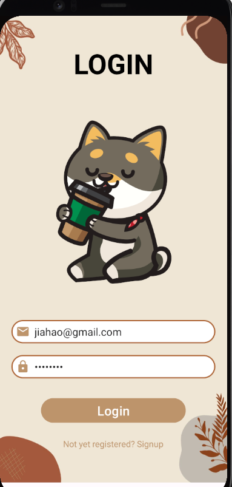
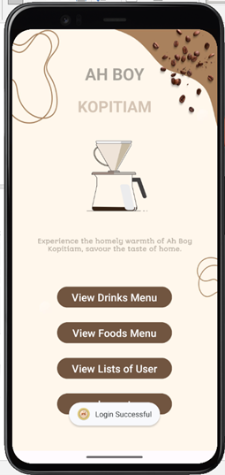
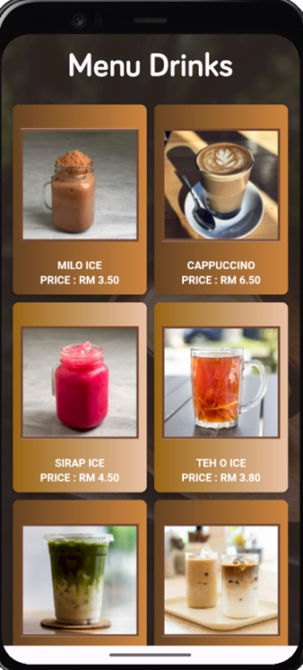
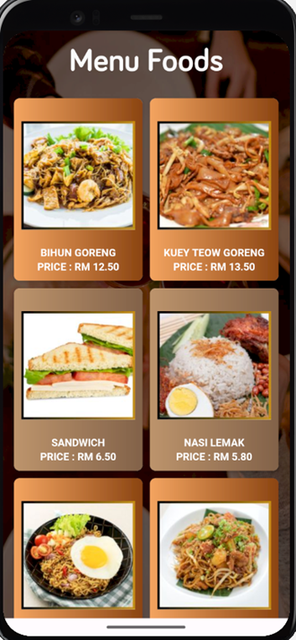

# 🍔 Android Food Ordering Application

📱 This is a mini Android mobile application project developed using Java, XML, and SQLite.

The application is designed for a food and drink ordering system. It includes basic mobile app features such as splash screen, intro screen, login, sign up, homepage, food list, drink list, and local database usage.

## ✨ Features

- 🚀 Splash screen
- 👋 Intro screen
- 🔐 Login page
- 📝 Sign up page
- 🏠 Homepage
- 🍽️ Food list page
- 🥤 Drink list page
- 🗄️ SQLite local database
- 📱 Simple Android user interface

## 🛠️ Technologies Used

- ☕ Java
- 🧾 XML
- 🗃️ SQLite
- 💻 Android Studio

## 🎯 Project Purpose

This project was developed to practice Android mobile application development, user interface design, page navigation, and local database implementation.

## 📚 Project Type

Mini Project for Mobile Application Development

## 🖼️ Screenshots

### Splash Screen

### Login Page

### Homepage

### Drinks Menu

### Foods Menu

